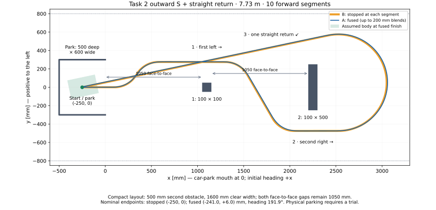

# Experimental fused motion sequence

Branch: `experiment/fused-motion-limits`.
Base: `90fa9d3b4d37080a7bf035abe1c3439fd2361ffb` on
`experiment/fused-motion-sequence`, with the separate-limits change adapted from
`feature/motion-profile-limits` commit `df2fc280541868bff87ff8813cf36dc48462deb0`.
The separate production UART and IMU-hardening changes are not included.

## Current default: settled Task 1 tuning A/B

The selected `MotionSequenceFusionTestRun()` now runs a short accuracy experiment.
Both A and B use the matched geometric reference
`LPF(curvature * measured speed)`, with the same 100 ms time constant, update dt
and zero initial state as the gyro-rate filter. A retains the reduced tuning;
B restores the settled straight/arc gains from `motionControllerConfig`:

| Run | Yaw-rate P / I / D | Heading gain (s⁻¹) |
| --- | --- | ---: |
| A reduced | 100 / 0 / 0 | 0 |
| B Task 1 | 100 / 50 / 0 | 0.5 |

The table reflects the current shared configuration. B copies its eight gain
fields directly, preserving any straight/arc differences. The ready screen
reads the actual controller configuration for both regimes; each result stores
its own `straightTuning` and `arcTuning` snapshot. Config and PID initialization
are validated before each ready screen without reinitializing the hardware/IMU.

Both fuse exactly the same path:

| Segment | Distance | Radius | Requested speed |
| --- | ---: | ---: | ---: |
| Entry straight | 300 mm | Straight | 5000 CPS |
| Left semicircle | 1649.34 mm (180°) | +525 mm | 5000 CPS |
| Exit straight | 600 mm | Straight | 5000 CPS |

Total commanded travel is **2549.34 mm**, displayed before each run. This is a
local turn/transition test. The longer obstacle course below remains available
through the experiment selector.

Both A and B use filter tau **0.10 s** and wheel **Kp=0.03, Ki=Kd=0**. Straight A/D is
3000/3000 mm/s²; arc and blend A/D is 2000/2000 mm/s². Feedforward calibration,
blend length (200 mm), junction ceiling (8000 CPS), steering slew (480 raw/s),
wheel synchronisation and feedback authority are identical between A and B.
The heading correction remains outside the geometric-reference filter;
B restores it together with the yaw-rate integral gain. Nominal raw steering feedforward always
uses current curvature. Shared production defaults select the existing filter.

Mark the rear-axle midpoint at `(0,0)`, heading `+x`. The unblended centreline
reaches `(300,0)`, then `(300,1050)` heading `-x`, then `(-300,1050)`. It extends
behind the starting line during the final straight. The nominal swept area is
approximately **1.6 m along x × 1.5 m along y**, allowing an assumed centred
300×200 mm chassis; leave room for tracking error and actual chassis offsets.
The blends preserve total nominal distance/yaw but slightly change XY.

1. Build/flash this branch and set a breakpoint at
   `MotionSequenceFusionTestFinished`.
2. Place the robot at the marked start. OLED shows `A reduced`, estimated
   travel and actual straight/arc gains. Press/release SW1 to run A.
3. After A stops, return the robot to the **same marked pose**. OLED shows
   `B Task1`; press/release SW1 to run B. SW1 during either run cancels it.
4. Export **once after both runs**, using a fresh filename:

```text
source exp/gdb_scripts/export_fused_motion.gdb
set $mctrl_fusion_battery_v = 11.66
mctrl-fusion-export fusion_task1_gains_run01.txt
```

Enter the actual battery voltage. The common log samples both trials every
20 ms (control period 10 ms). Each has a reserved 325-sample budget, about
6.5 seconds including preparation/braking. Overflow sets the per-run/global
truncation flags, retains the final sample and invalidates the accuracy comparison.
A failed/cancelled run does not launch B. Button waits/resetting are excluded
from elapsed times. One exporter captures the selector, sampling period,
per-run filter choice and gain snapshots, both results and all tagged samples.
The final controller config is B's; A's result retains its reduced tuning. The original time-savings fields
remain zero for this accuracy experiment.

Inspect raw and filtered gyro rates alongside
`unfilteredGeometricYawRateRadPerSec`, `filteredGeometricYawRateRadPerSec` and
`targetYawRateRadPerSec`. Compare steering-correction saturation and oscillation
at both blends, sustained yaw-rate bias on the constant arc, and heading error
entering/leaving the final straight. Record physical endpoint displacement
separately. This compares the complete settled tuning against the reduced
baseline. It does not isolate the contribution of integral versus heading
feedback, or establish full Task 2 parking accuracy.

The host regression supplies perfect coincident wheel/gyro samples: the existing
formulation reaches the 30-unit correction clamp during changing curvature,
whereas the matched formulation produces near-zero correction. It also checks
reverse motion, zero filter tau, constant-curvature speed ramps, reference
history/reset, and all three experiment modes including cancellation/timeouts.
The tuning comparison additionally checks that both filters are matched, that
B restores the actual PI/heading configuration before preparation, and that
its heading correction contributes to the logged yaw-rate request. These are
software checks, not a servo/vehicle simulation or physical results.

The previous filter-only A/B remains available as
`MOTION_SEQUENCE_FUSION_TEST_REFERENCE_FILTER`: A existing filtering, B matched,
both with 100/0/0 yaw-rate gains and heading gain zero. It uses the same short
path, 20 ms logging and single export. The current default selector is
`MOTION_SEQUENCE_FUSION_TEST_TASK1_GAINS`.

To restore the Task 2 fused-versus-stopped timing test, change the initializer
of `motionSequenceFusionTestExperiment` in `MotionSequenceFusionTest.c` to
`MOTION_SEQUENCE_FUSION_TEST_TASK2_TIMING`, or set it in GDB before the run.
That mode retains the original course, original yaw/heading tuning, 100 ms
logging and time-savings report. The remaining course description applies to
that timing mode.

## Wheel-performance settings

The optional timing A/B harness requests 5000 CPS on a Task 2 outward-S / straight-return course
that returns to the car park. Both traces use one experiment-local configuration:

| Motion | Acceleration (mm/s²) | Deceleration (mm/s²) |
| --- | ---: | ---: |
| Straight | 3000 | 3000 |
| Arc / curvature-changing blend | 2000 | 2000 |

Both wheel PID gains are Kp = 0.03, Ki = 0. These are candidates from the wheel
campaign, pending validation with steering, heading and synchronisation active.
Shared controller defaults remain 1500/1000 for both modes and wheel Kp = 0.02.

Constant straight sections use straight limits. Any curvature-changing blend
uses arc limits throughout, including opposite-turn blends as curvature crosses
zero. Gain interpolation remains independent of this limit selection. Joined
straight segments keep straight limits even within their nominal blend interval.
The same selection applies to the stopped comparison's `FollowProfile` runs.

Lookahead integrates deceleration over each section ahead: the squared speed
budget is `2 * integral(deceleration * distance)`. Thus a straight can exploit
its stronger limit while approaching a weaker arc, and final stopping accounts
for later sections instead of extending the current section's limit to the end.
The final yaw-priority approach uses that budget up to its terminal window too.
Existing yaw-priority completion, stationary confirmation and fault handling
are preserved. These are centre-speed limits: curvature changes and feedback
can still add wheel acceleration/deceleration demand; hardware tracking must be
checked. This change does not establish a wheel-acceleration guarantee.

Each sample logs active acceleration/deceleration limits and the planned
stopping-speed ceiling. The one final GDB export includes both traces, their
actual controller configuration and both wheel PID configurations.

## First implementation

`MotionSequence` owns the batch, lookahead, blend/stop policy and completion.
It uses the new `MotionController_FollowProfile()` capability for each continuous
run. The original straight/arc APIs and their tuning/terminal behaviour are
retained. No heap allocation; capacity is 20 nonzero segments (the current Task 2 course needs 10).

Each curvature change gets a symmetric linear curvature ramp. Its full length
is at most `blendLengthMm`; each neighbour supplies at most one quarter of its
own length. Thus blends on both sides of a short segment cannot overlap.
Equal-curvature segments join without a curvature change or an extra speed cap.

The ramp consumes existing distance, adds zero nominal distance, and preserves
the integral of curvature over signed travel. Desired heading is evaluated by
analytic integration, not by multiplying current curvature by total travel.
Intermediate junctions are virtual: their exact position and heading are not
required. The final **nominal** heading and distance are preserved, while the
XY trajectory differs from the original piecewise straight/arc path.

Straight-ending profiles and intermediate stopped runs complete by distance
using the inherited 0.5 mm tolerance. If the batch ends in an arc exceeding the
inherited 0.5-degree minimum, its final run instead retains **yaw-priority arc
termination** for camera heading:

* The final target is the analytically integrated heading of the entire current
  fused run. It includes preceding segments and their blends, so yaw error
  accumulated within that run remains visible to termination.
* The approach speed is limited toward 800 CPS before the terminal window.
  The window begins in the final constant-curvature section, after its incoming
  blend, and at most 30 mm before nominal distance completion.
* The braking decision predicts stopping yaw from the freshest raw gyro rate
  using the inherited 75 ms horizon. Direction comes from final arc curvature
  and travel direction, even when mixed turns give zero or opposite-sign net yaw.
* The controller may brake before nominal distance completion if predicted yaw
  reaches the target, or continue at up to 400 CPS when distance finishes first.
  Creep is also capped by the final segment's requested speed.
* Heading and curvature references freeze at the nominal endpoint during
  overrun. The inherited maximum 30 mm overrun guard still forces braking.

Both termination paths use the existing centred-steering braking and stationary
sample completion. The desired geometric path still preserves nominal distance
and heading area, but final-arc actual distance may now differ to prioritise
camera orientation. Actual tracking and the empirical stopping-yaw prediction
still require hardware validation. No final XY-pose guarantee is provided.

`terminalYawPredictedReached` and `terminalDistanceLimitReached` distinguish
heading-triggered braking from the distance guard; reaching the guard alone does
not demonstrate successful camera heading. Final measured yaw includes braking
and may differ from predicted yaw. Completed-run errors across earlier stops
remain diagnostic and are not carried into the final run's heading reference.

Direction changes and `stopAfter=true` split the batch into rest-to-rest runs.
The next run starts only after braking reports stationary for the configured
sample count, then performs its initial steering preparation. Zero-distance
commands are no-ops; a zero-distance stop marks the preceding segment.

Within a run, odometry, yaw, measured-speed/yaw-rate filters, synchronisation
history and yaw-rate PI state continue across junctions. Gain weights interpolate
between the straight and arc endpoint regimes over each blend. Integral state
is rescaled to preserve its output contribution when Ki changes; Ki=0 clears
that contribution. Opposite-sign arc blends use arc gains throughout. The
profile's raw steering slew limiter remains in effect. A per-run rate override
is copied from the sequence configuration; zero inherits the normal steering
calibration rate. Standalone motions always retain their normal rate, including
when issued after a fused run on the same controller.

## Experimental feedforward bridge and junction speed

The calibrated arc branches stop short of zero curvature. Profiles alone use a
linear bridge from the configured straight raw feedforward to the nearest
point in each branch. This is an **unvalidated near-centre model**, needed for a
continuous straight/arc or opposite-sign blend. Standalone `MoveArc` still
rejects the uncalibrated near-zero gap. The outer calibrated limits are never
extrapolated. Existing servo clamping and the base's limited-headroom arc
experiment remain; feedback may run out of headroom at extreme commands.

Defaults in `Controllers/Src/MotionSequencePlan.c`:

| Setting | Value |
| --- | ---: |
| Maximum full blend length | 200 mm |
| Curvature-changing junction speed ceiling | 8000 CPS |
| Fused-profile raw steering slew limit | 480 raw units/s |
| Feedforward allocation of configured raw slew rate | 50% |

These retain the latest fusion branch settings. The 8000 CPS ceiling is
still bounded by each segment's requested speed and the steering slew budget. The sequence's slew override is used by both the planner and the
steering executor; it does not modify `steeringCalibration` (120 raw units/s).
Set `steeringCommandRatePerSec=0` to inherit that rate. For the original slow
profile use `{.blendLengthMm=200, .junctionSpeedCps=500,
.steeringCommandRatePerSec=0}`. Overrides must be finite and nonnegative.

The planner also limits junction speed using the largest slope of the complete
piecewise-linear feedforward map (including the centre bridge), curvature ramp
length, and effective per-sequence raw slew rate. The remaining slew allowance is reserved
for feedback; it is not a guaranteed physical servo margin. Speed lookahead
uses the integrated straight/arc deceleration to approach each lower
segment/junction speed before its boundary. `MotionProfile` supplies the active
section's acceleration and consumes the planner's final stopping envelope.
These are configurable software protections, not a measured servo speed limit.

## API example

Keep the sequence object and its controller alive until execution finishes.
Check every returned status in application code. Configuration, calibration and
the sequence plan must remain unchanged while running. Do not reuse a running
sequence object or issue separate commands to its controller.

```c
static MotionSequence sequence;

MotionSequence_Begin(&sequence, &robot.motionController, &motionSequenceConfig);
MotionSequence_AddStraight(&sequence, 300.0f, 2000.0f, false);
MotionSequence_AddArc(&sequence, 500.0f, -500.0f, 2000.0f, false);
MotionSequence_AddStraight(&sequence, 300.0f, 2000.0f, false);
MotionSequence_Execute(&sequence); /* asynchronous */

/* At each control period: */
MotionSequence_Update(&sequence, dt);
```

Call only `MotionSequence_Update`, not also `MotionController_Update`.
`MotionSequence_Brake` cancels the remaining batch and enters braking; continue
updates until `MotionSequence_IsBusy` is false. IMU/profile errors retain the
base controller's immediate Stop/coast error semantics and mark the sequence
failed; remaining runs are not launched. `completedMeasuredTravelMm` and
`completedMeasuredYawRad` accumulate completed runs including braking drift.
They are separate from `plan.totalTravelMm` and `plan.nominalFinalYawRad`.

## Software-only checks

Run with Python 3 and GCC on Linux/WSL:

```sh
python3 Tests/Host/test_unified_motion.py
python3 Tests/Host/test_fused_motion.py
python3 Tests/Host/test_motion_profile_limits.py
# Optional: exporter check using installed host GDB
python3 Tests/Host/test_fused_export.py --gdb /path/to/gdb
```

The fusion test compiles production planner/controller/steering/PID/profile
sources and the actual robot test harness against hardware stubs. It uses
`-Wall -Wextra -Werror -pedantic` and address/undefined-behaviour sanitizers.
Leak tracing is disabled for managed-container compatibility; tested components
perform no heap allocation.

Coverage includes analytic and independently integrated curvature area, total
distance, 150 deterministic generated plans, asymmetric/short segments,
forward/reverse signs, both arc signs, opposite-sign ramps, speed lookahead,
software slew bounds, gain/integral continuity, one preparation per continuous
run, reversals/stop waypoints, capacity/invalid inputs, cancellation, faults,
and the selected hardware harness's completion/cancellation/timeout/final log.
Final-arc cases cover early predicted-yaw braking, continued motion after nominal
arc distance, frozen references on overrun, bounded distance-guard braking,
forward/reverse travel with both turn signs, zero/opposite-sign net targets,
short final arcs, low requested speeds and final-only policy selection.
The faster-profile checks also verify that both original straight/arc test junctions retain
2000 CPS, the executor uses the 480 raw units/s override, a subsequent standalone
motion returns to 120 raw units/s, zero inherits that limit in planner/executor,
and invalid rate overrides are rejected before motion.

The original 300 mm / R=-500 mm arc / 300 mm experiment completed in 4885 ms
in the ideal encoder/gyro harness, versus 8526 ms with the previous defaults
(about 43% less time). The current harness uses the longer A/B course below.
This measures software speed/preparation/braking scheduling with synthetic
perfect speed tracking, not physical servo response or robot accuracy.

The real GDB exporter also passed checks against initialized host ELF data:
plan/config/result fields, all samples, empty/invalid-count guards and the
complete marker. It did not require a running process or a probe.

The standalone suite sets explicit preparation times and a heading gain for
its heading-bound checks, so those checks do not depend on experiment defaults.
The separate-limits checks cover all four limits, forward/reverse mode changes,
completion-tolerance preservation, invalid inputs and arc terminal approach.
Fusion checks additionally cover local limit changes, independent integration
of the stopping envelope, stronger straight approach to a weaker arc, stopped
mode selection, opposite-turn zero crossing and the experiment's actual gains.

The full ARM Debug firmware builds and links with the configured source
exclusions and the unchanged STM32 FLASH linker script. Changed firmware sources
also pass `-Wall -Wextra -Werror`. The final image uses approximately 98 KiB FLASH
code/constants and approximately 113 KiB RAM (including the shared sample buffer, heap and stack
reservations), within the STM32F407's configured memory. Control-period timing
and physical robot trials still require hardware validation.

## Optional Task 2 timing experiment

`Tests/Src/TestMain.c` selects `MotionSequenceFusionTestRun()` on this branch.
CubeIDE's existing Controllers/Tests source folders include the new `.c` files;
refresh the project and clean/rebuild before flashing. Existing production
UART/RPi integration is outside this first experiment.

In `MOTION_SEQUENCE_FUSION_TEST_TASK2_TIMING` mode, the harness runs the same
**Task 2 outward S and straight return** twice at
**5000 CPS requested for every straight and arc**. Assume the first arrow points
left and the second points right. It leaves the car park, passes the first
obstacle on its left and the second on its right, turns around beyond the
second, then drives **one straight diagonal back into the park**, above both
obstacles. There are no return-side crossovers or additional parking bends.
All travel is forward.



### Midpoint layout and starting pose

Use millimetres, x along the initial forward direction and positive y to the
left. The car-park mouth is x=0. The corrected park dimensions have the **500 mm
side along x (depth), and 600 mm across y (width)**. Set up these test assumptions:

| Item | Placement / dimension |
| --- | --- |
| Park interior | x=-500…0, y=-300…300; open at x=0 |
| Initial rear-axle reference pose | (-250, 0), heading +x |
| Park mouth to first obstacle near face | 1050, midpoint of 600…1500 |
| First obstacle | centre (1100, 0), 100 × 100 |
| First far face to second near face | 1050, midpoint of 600…1500 |
| Second obstacle | centre (2250, 0), 100 along x × 500 along y |
| Assumed arena clear width | 1600, boundaries y=±800 |
| Outbound lanes | first y=+275; second y=-475 |
| Far turnaround | starts at (2525, -475), R=525 |

The second obstacle is a **500 mm compact-trial choice**. The two longitudinal
gaps keep their 1050 mm midpoint values and are measured between faces, not
centres. The 1600 mm assumed clear width leaves 550 mm between each end of the
second obstacle and the side boundary, exceeding the task's 500 mm minimum.
The task does not specify a fixed numerical maximum obstacle length or arena
width; this is the chosen test layout.

The first outbound lane remains 275 mm from the centreline; the second is now
475 mm from it. On both constant straights, the assumed centred 200 mm-wide
body has 125 mm between its side and the respective obstacle. The smaller
return radius and closer turnaround reduce the path's extent as well as the
obstacle's size.

The centre path reaches approximately x=3050 and y=+575/-475. Both planner
modes pass the assumed footprint checks within x=-500…3300 and y=±800,
including the car park: approximately **3.8 m length × 1.6 m width** of clear
space. Physical tracking and actual chassis offsets still need checking.

### Sequence

The stopped route has these 10 segments. Positive radius turns left. Distances
are rounded here; the contained `fusionTestSteps[]` table in
`MotionSequenceFusionTest_BuildPattern()` uses the geometric constants at the
file top and calculates the return tangent from the park's target position.

| Segment | Motion | Distance (mm) | Radius / heading change |
| ---: | --- | ---: | --- |
| 1 | Exit parking stem | 350 | straight |
| 2–3 | Move to first left lane | 287.98 each | +275 / +60°, then -275 / -60° |
| 4 | Pass first obstacle left | 723.41 | straight |
| 5 | Begin outbound crossover | 287.98 | -275 / -60° |
| 6 | Diagonal between obstacles | 548.48 | straight |
| 7 | End outbound crossover | 287.98 | +275 / +60° |
| 8 | Pass second obstacle right | 474.72 | straight |
| 9 | Turn onto return tangent | 1758.70 | +525 / +191.94° |
| 10 | Straight diagonal into park and stop | 2725.34 | straight |

The far-turn circle is centred at (2525, +50). Its upper tangent through the
park centre gives a turnaround angle of 191.936° and tangent distance of
2725.344 mm. The stopped tangent starts at approximately (2416.42, +563.65)
and ends at (-250, 0). This avoids aiming a return line through either obstacle.
The robot enters the park **about 11.94° oblique to the inward axis**; there is
no final alignment turn. The goal here is parking the whole robot inside.

Nominal travel is **7732.58 mm**, with net yaw **+191.936°**. The stopped centre
path returns to (-250, 0); the fused planner ends at approximately
(-240.97, +6.03), a 10.9 mm displacement from that target. Both have the same
nominal final heading. The final 2.73 m straight includes deceleration and
braking inside the park; both batches therefore finish by distance, rather
than final-arc yaw-priority termination. B's intermediate arcs also finish by
distance, as discussed above.

The host check integrates the production planner at at most 1 mm spacing for
both modes. It checks the tighter first outbound pass, obstacle sides in both
directions, obstacle clearance, arena side bounds and park-wall clearance,
including body intersections with the mouth. Its footprint is an **assumed
centred 300 × 200 mm rectangle**, enclosed by a 181 mm radius circle with an
additional 20 mm obstacle margin. The tilted final rectangles are wholly inside
the corrected park. The last segment is checked as a single straight return.
This verifies nominal geometry, not the actual chassis footprint or tracking;
check the robot's rear-axle-to-body offsets and physical parking in the trial.

**A** sets `stopAfter=false` on every segment and executes one continuous run.
**B** sets `stopAfter=true` on every segment and executes 10 rest-to-rest runs.
The segment table, controller configuration and sequence configuration are
otherwise identical. A keeps the 8000 CPS junction ceiling, bounded by the
5000 CPS requests and feedforward slew budget. Blends shrink on the shorter
60° arcs; B has no junction blending. This fixed-route experiment does not yet
implement arrow recognition, obstacle measurements or vision/IR approach stops.

To regenerate the diagram from the production planner (requires matplotlib):

```sh
python3 Tests/Host/plot_task2_route.py
```

Keep the robot stationary through normal IMU startup. Press/release SW1 to
start A. After A completes, the robot remains stopped and prompts for B.
Check that A parked, then reset it to (-250, 0) facing +x and press/release SW1
to start B. A finishes at about 191.94°, so rotate it for the identical B starting pose.
Each button wait and 400 ms hand-clearance delay is excluded from timing. Each run's
timer starts just before `MotionSequence_Execute()` and ends after completion
including controller steering preparation and final braking.

Press SW1 during either trace to cancel and brake. Each trace has a 60 s
watchdog and a further 3 s braking timeout. Failure/cancellation of A prevents B
from starting; failure of either trace prevents a valid timing comparison.
`Passed` means both batches completed without an API error, not that their
physical path/heading met an accuracy criterion.

The final OLED screen shows A's fused time, B's stopped time, milliseconds saved
(`B-A`) and percentage reduction (`100*(B-A)/B`). A negative saving is retained
if the fused trace is slower. Incomplete trials show `INVALID` and no savings.
Debugger-visible `motionSequenceFusionTestResults[0]` and `[1]` retain per-trace
status, times, run counts, nominal/measured travel and yaw, and truncation flags.
`motionSequenceFusionTestComparisonValid` guards the saved-time/percentage
fields. The existing `motionSequenceFusionTestElapsedMs` is the last trace's time.

One shared log holds 650 samples at 100 ms (about 65 s of combined running time)
without duplicating the large sample buffer. Each sample's `comparisonRunIndex`
is 0 for A or 1 for B; `timeMs` restarts at zero for each trace. Manual waiting is
not logged. If full, the final slot is replaced with the latest trace's final
sample and truncation is flagged globally and in that trace's result. Summary
results remain available even if detailed logging is truncated.

In the ideal encoder/gyro host harness, A takes 15632 ms and B takes 15995 ms:
363 ms saved, or about 2.3%. This is a software scheduling check, not a physical
servo/vehicle performance prediction. The harness also verifies cancellation
and timeout in either A or B, withholding savings for incomplete comparisons,
manual-wait exclusion, per-trace logging and OLED text-row coordinates.

To run the original standalone/yaw-priority sequence harness instead, restore
`MotionControllerSequenceTestRun()` in `TestMain.c`.

Set a breakpoint on `MotionSequenceFusionTestFinished` before starting. Once
the target is suspended there, run these in the GDB console (cwd = project):

```text
source exp/gdb_scripts/export_fused_motion.gdb
set $mctrl_fusion_battery_v = 11.95
mctrl-fusion-export fusion_run01.txt
```

Enter the actual measured voltage. Choose a new output name for each run;
export appends if the name already exists. The command exports both A/B results and the timing comparison, the last
trace's complete plan, actual experiment tuning and wheel PID gains, final heading policy/termination flags
and tagged samples from both traces. It neither resumes
the target nor initiates motion. The old automatic sequence-export breakpoint
does not apply to this harness.

Inspect the saved timing comparison together with speed/raw-command tracking,
absence of intermediate preparation/braking in A, measured final travel/yaw
for both traces, and whether the entire robot parked without touching a wall.
Record physical final x/y/heading error separately: this harness logs travel/yaw,
not absolute XY pose, and successful API completion does not establish parking. Physical tracking may require longer blends, lower junction
speeds or centre-region calibration; the host tests cannot settle those choices.
